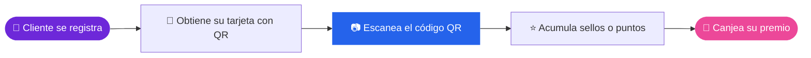

<div align="center">


</div>

<div align="center">


<br/>

**Premia a tus clientes frecuentes de forma ágil, cómoda y segura, usando únicamente tu celular y tu laptop.**

<br/>

[](#-producto)
[](#-requisitos)
[](#-artefactos)
[](#-estructura-del-repositorio)
[](#-bitácoras)
[](#-competencias)
[](#-equipo)

</div>

---

## 🎯 Producto

> **LoyaltyAccess** es una aplicación web para crear y operar programas de lealtad **por sellos o por puntos**. El cliente recibe una tarjeta digital con un **código QR único**, no instala ninguna app, y sus sellos o puntos se acumulan automáticamente cada vez que se escanea.

El problema: las tarjetas de cartón se pierden, se falsifican o se llenan sin control, y las soluciones digitales suelen exigir un punto de venta o equipo especial. **LoyaltyAccess funciona desde el navegador de un celular o una laptop**, sin inversión ni conocimientos técnicos.

### ✨ ¿Cómo funciona?



---

## 📋 Requisitos

Especificaciones funcionales y no funcionales del sistema:

[](docs/requisitos/requisitos%20funcionales.md)
[](docs/requisitos/requisitos%20no%20funcionales.md)

---

## 🧩 Artefactos

Documentos clave del diseño y desarrollo del producto:

| | Artefacto | Qué contiene | |
|:-:|:--|:--|:-:|
| 📘 | **Descripción de producto** | Objetivo, usuarios, escenarios y propuesta de valor | [](docs/producto/descripcion%20de%20producto.md) |
| 🎭 | **Casos de uso** | Cómo interactúan los actores con el sistema | [](docs/artefactos/casos%20de%20uso.md) |
| 🗂️ | **Diagramas de clases** | Modelo de dominio y patrones de diseño aplicados | [](docs/artefactos/diagramas%20de%20clases.md) |
| 📝 | **Historias de usuario** | Necesidades de los usuarios y criterios de aceptación | [](docs/artefactos/historias%20de%20usuario.md) |

---

## 📂 Estructura del Repositorio

*Organización actual de las carpetas y archivos del proyecto:*

```text
loyaltyaccess/
├── 📁 .github/
│   └── 📁 workflows/        # Automatizaciones y CI/CD
├── 📁 docs/                 # Documentación del proyecto
│   ├── 📁 artefactos/       # Casos de uso, diagramas e historias de usuario
│   ├── 📁 bitacoras/        # Seguimiento semanal
│   ├── 📁 competencias/     # Competencias específicas y genéricas
│   ├── 📁 producto/         # Descripción del producto
│   └── 📁 requisitos/       # Requisitos funcionales y no funcionales
├── 📁 src/                  # Código fuente de la aplicación
├── 📄 .gitignore
├── 📄 LICENSE
└── 📄 README.md
```

---

## 📊 Bitácoras

Seguimiento semanal y reportes de desarrollo del equipo, todo reunido en un solo lugar:

[](docs/bitacoras/)

---

## 🏅 Competencias

Competencias desarrolladas a lo largo del proyecto:

[](docs/competencias/especificas.md)
[](docs/competencias/genericas.md)

---

## 👥 Equipo

<div align="center">

| 👤 Integrante | 🎭 Rol |
|:---|:---|
| **Rodrigo Salazar** | 📋 Scrum Master |
| **Freddy Correa** | 💼 Product Owner |
| **Jose Correa** | ⚙️ Developer |
| **Rodrigo Rivera** | ⚙️ Developer |
| **Mauricio Álvarez** | ⚙️ Developer |

</div>