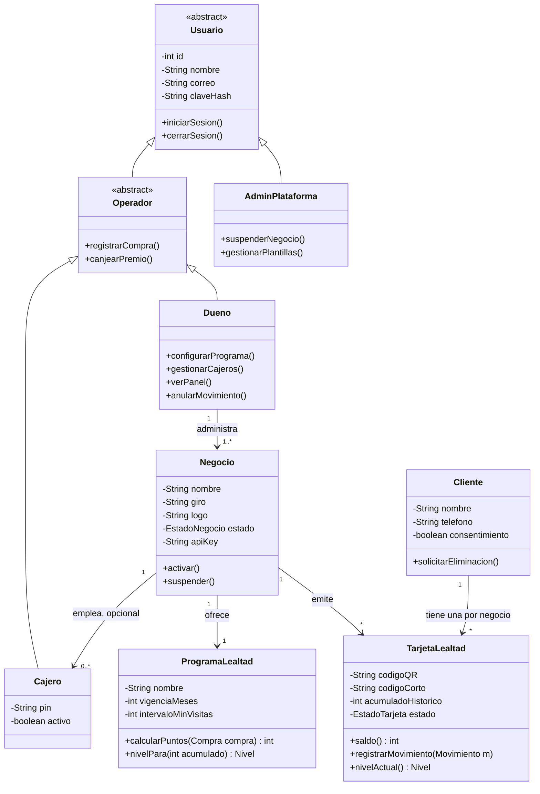
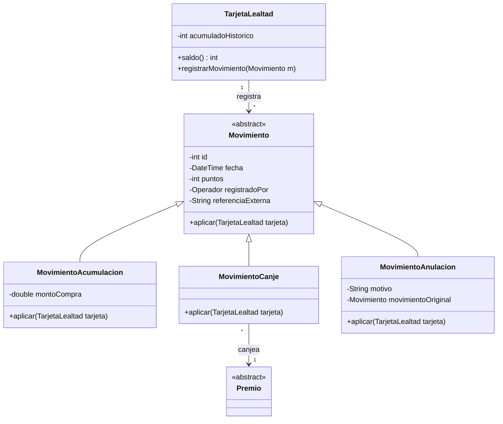
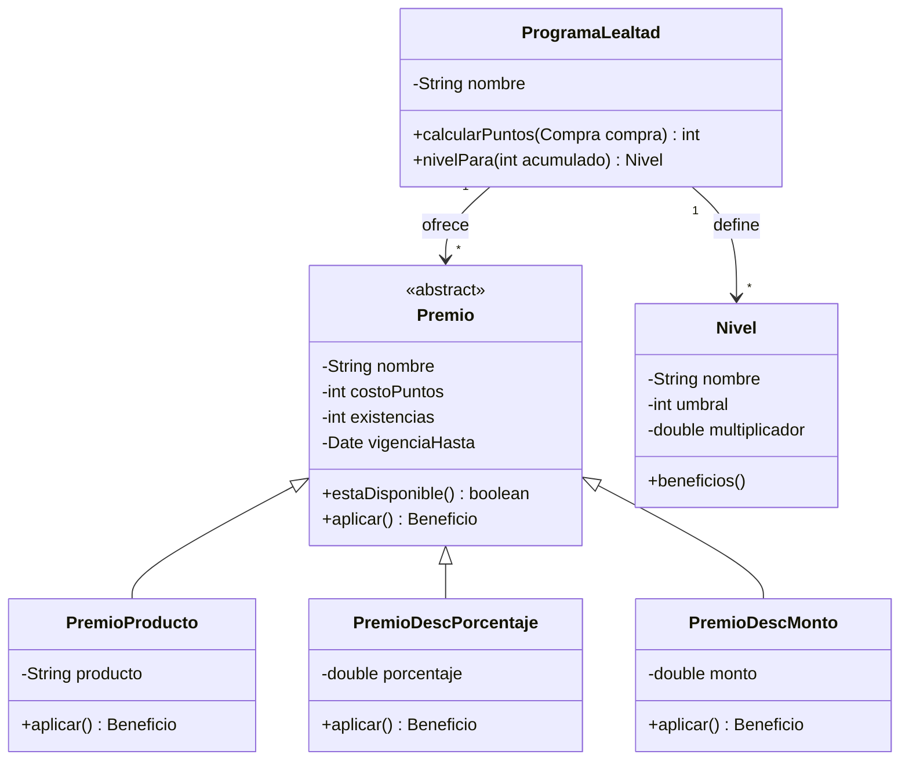
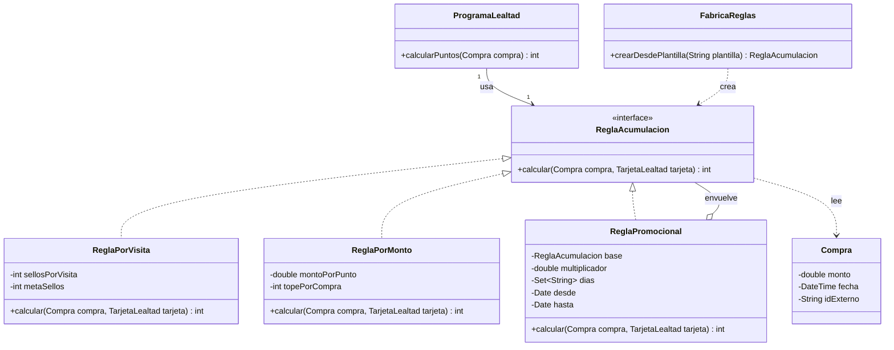
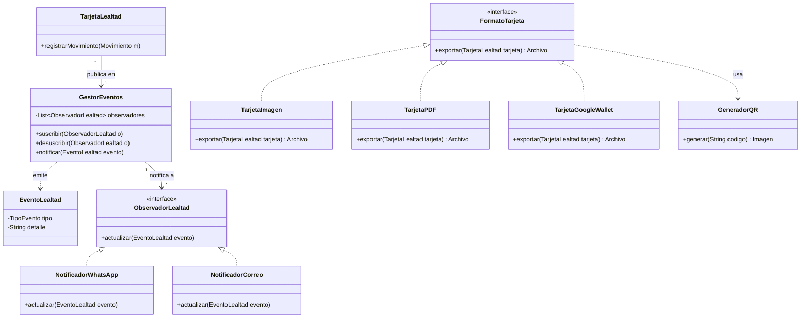
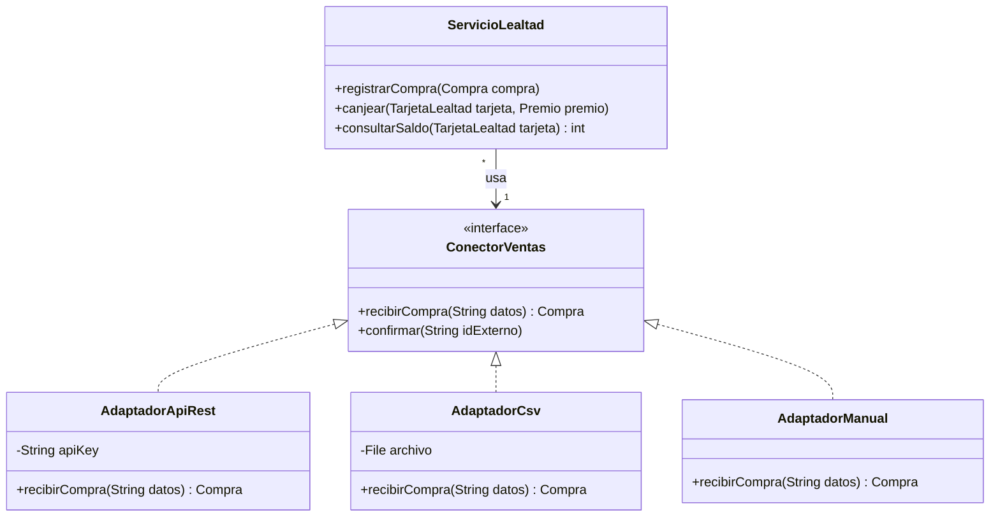

# Diagramas de clases

**Proyecto:** LoyaltyAccess
**Alcance:** modelo de dominio del sistema de tarjetas de lealtad con QR para pequeños negocios.

Los diagramas se presentan por bloques para facilitar su lectura: usuarios y negocio, movimientos, premios y niveles, reglas de acumulación, notificaciones y exportación, y conectores externos. Se incluyen solo las clases de dominio; los controladores, la configuración y el acceso a datos se documentan en el documento de arquitectura.

## Notación

| Símbolo | Significado |
|---|---|
| `+` | Miembro público |
| `-` | Miembro privado |
| `<<abstract>>` | Clase abstracta |
| `<<interface>>` | Interfaz |
| `A <\|-- B` | Herencia: B hereda de A |
| `A <\|.. B` | B implementa la interfaz A |
| `A --> B` | Asociación: A conoce o usa a B |
| `A o-- B` | Agregación: A contiene a B |
| `A ..> B` | Dependencia: A usa o crea a B |
| `"1"`, `"*"`, `"0..1"` | Multiplicidad de la relación |

---

## 1. Usuarios, negocio, programa, clientes y tarjetas

Los roles del sistema se organizan así: `Dueno` y `Cajero` heredan de `Operador`, que agrupa lo que puede hacer quien atiende en mostrador (registrar compras y canjes), y `Operador` y `AdminPlataforma` heredan de `Usuario`. Así, un emprendedor que trabaja solo con su celular y su laptop puede operar como dueño sin necesidad de dar de alta cajeros. El dueño administra uno o más negocios; cada negocio tiene su programa de lealtad, cajeros opcionales y emite tarjetas. Un cliente tiene una tarjeta por negocio.

---

## 2. Movimientos de la tarjeta

El saldo de una tarjeta no se edita directamente: se calcula a partir de sus movimientos, que nunca se borran. Una anulación genera un movimiento inverso que referencia al original.

---

## 3. Premios y niveles

El programa ofrece premios de distintos tipos (producto gratis, descuento porcentual o descuento en monto) y define los niveles del cliente según sus puntos acumulados históricos.

---

## 4. Reglas de acumulación (Strategy, Decorator y Factory)

Cada programa usa una regla para calcular los puntos o sellos de una compra. `ReglaPromocional` decora a otra regla con un multiplicador temporal (por ejemplo, doble de puntos los martes). `FabricaReglas` crea la regla a partir de una plantilla.

---

## 5. Notificaciones (Observer) y exportación de la tarjeta (Strategy)

Cuando una tarjeta registra un movimiento, publica un evento (puntos abonados, premio disponible, subida de nivel) y el gestor avisa a los canales suscritos. Por separado, la tarjeta puede exportarse en distintos formatos mediante una interfaz común.

---

## 6. Conectores para sistemas externos (Adapter)

Módulo opcional para negocios que ya cuentan con un sistema de ventas. El núcleo de lealtad solo conoce la interfaz `ConectorVentas`; cada adaptador traduce los datos de una fuente distinta.

---

## Descripción de las clases

| Clase | Tipo | Responsabilidad | Relaciones |
|---|---|---|---|
| `Usuario` | Abstracta | Datos y comportamiento comunes de acceso. | Padre de `Operador` y `AdminPlataforma`. |
| `Operador` | Abstracta | Agrupa lo que puede hacer quien atiende en mostrador: registrar compras y canjear premios. | Hereda de `Usuario`; padre de `Dueno` y `Cajero`. |
| `Dueno` | Concreta | Configura el programa, gestiona cajeros, anula movimientos y consulta el panel; también puede operar directamente si trabaja solo. | Hereda de `Operador`; administra `Negocio`. |
| `Cajero` | Concreta | Empleado opcional que registra compras y canjes con su PIN. | Hereda de `Operador`; pertenece a un `Negocio`. |
| `AdminPlataforma` | Concreta | Aprueba o suspende negocios y administra plantillas. | Hereda de `Usuario`. |
| `Negocio` | Concreta | Representa un comercio y agrupa su programa, cajeros y tarjetas. | Pertenece a un `Dueno`; emite `TarjetaLealtad`. |
| `ProgramaLealtad` | Concreta | Define reglas, premios y niveles, y calcula los puntos. | Usa `ReglaAcumulacion`; ofrece `Premio` y `Nivel`. |
| `Cliente` | Concreta | Persona que participa en el programa de un negocio. | Tiene una `TarjetaLealtad` por negocio. |
| `TarjetaLealtad` | Concreta | Cuenta del cliente: QR, código corto, saldo y nivel. | Registra `Movimiento`; publica eventos. |
| `Movimiento` | Abstracta | Cambio inmutable en el saldo de una tarjeta. | Padre de `MovimientoAcumulacion`, `MovimientoCanje` y `MovimientoAnulacion`. |
| `ReglaAcumulacion` | Interfaz | Contrato para calcular puntos o sellos de una compra. | Implementada por `ReglaPorVisita`, `ReglaPorMonto` y `ReglaPromocional`. |
| `ReglaPromocional` | Concreta | Decora otra regla con un multiplicador temporal. | Envuelve a una `ReglaAcumulacion`. |
| `FabricaReglas` | Concreta | Crea reglas a partir de plantillas. | Crea `ReglaAcumulacion`. |
| `Compra` | Concreta | Datos de una compra o visita (monto, fecha, ID externo). | Leída por las reglas. |
| `Premio` | Abstracta | Beneficio canjeable con costo, vigencia y existencias. | Padre de `PremioProducto`, `PremioDescPorcentaje` y `PremioDescMonto`. |
| `Nivel` | Concreta | Categoría del cliente con umbral y multiplicador. | Definido por `ProgramaLealtad`. |
| `GestorEventos` | Concreta | Sujeto del patrón Observer: administra suscriptores y publica eventos. | Notifica a `ObservadorLealtad`. |
| `ObservadorLealtad` | Interfaz | Contrato para reaccionar a eventos del programa. | Implementada por `NotificadorWhatsApp` y `NotificadorCorreo`. |
| `FormatoTarjeta` | Interfaz | Contrato para exportar la tarjeta. | Implementada por `TarjetaImagen`, `TarjetaPDF` y `TarjetaGoogleWallet`. |
| `GeneradorQR` | Concreta | Genera la imagen del código QR a partir del código de la tarjeta. | Usada por `FormatoTarjeta`. |
| `ConectorVentas` | Interfaz | Contrato para recibir compras de sistemas externos. | Implementada por `AdaptadorApiRest`, `AdaptadorCsv` y `AdaptadorManual`. |
| `ServicioLealtad` | Servicio | Coordina los casos de uso: registrar compra, canjear y consultar. | Usa reglas, premios, gestor de eventos y conectores. |

## Patrones de diseño aplicados

| Patrón | Dónde se aplica | Beneficio |
|---|---|---|
| Strategy | `ReglaAcumulacion` y `FormatoTarjeta`. | Agregar reglas o formatos sin modificar las clases existentes. |
| Decorator | `ReglaPromocional` envuelve a otra regla. | Combinar promociones con cualquier regla base sin crear una subclase por cada combinación. |
| Observer | `GestorEventos` y `ObservadorLealtad`. | Desacopla el registro del movimiento de los canales de aviso. |
| Factory Method | `FabricaReglas`. | Centraliza la creación de reglas y oculta las clases concretas. |
| Adapter | `ConectorVentas` y sus adaptadores. | El núcleo no cambia al integrarse con distintos sistemas. |

## Pilares de la POO en el diseño

| Pilar | Aplicación |
|---|---|
| Abstracción | Clases abstractas e interfaces (`Usuario`, `Operador`, `Movimiento`, `Premio`, `ReglaAcumulacion`, `ConectorVentas`) que modelan lo esencial. |
| Encapsulamiento | El saldo no es un atributo editable: se obtiene de los movimientos y solo cambia mediante `registrarMovimiento()`. |
| Herencia | `Dueno` y `Cajero` heredan de `Operador`, y este de `Usuario`; los tipos de movimiento y de premio heredan de sus clases base. |
| Polimorfismo | `calcular()`, `aplicar()` y `exportar()` se comportan distinto según la clase concreta. |

## Notas

- El cajero es opcional: el dueño hereda de `Operador` y puede registrar compras y canjes directamente, lo que permite que un negocio con solo un celular y una laptop use el sistema sin más personal.
- Los nombres de clases no llevan acentos ni la letra ñ (por ejemplo, `Dueno`) para evitar problemas en el código.
- Los diagramas son del diseño inicial y pueden ajustarse durante el desarrollo; cualquier cambio debe reflejarse en este documento en el mismo sprint.
- Los módulos de notificaciones, exportación y conectores incluyen funcionalidades opcionales (Google Wallet, API REST) definidas como extras en los requisitos.
